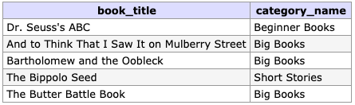
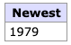
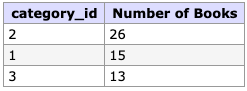
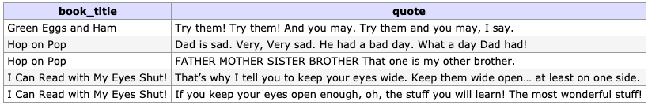

# Seussology DB I

## Objective
For this assignment you will be demonstrating your skills and understanding of SQL Queries by creating queries that create, read, update, and delete data from the Seussology Database.

## Database
For this assignment you will be using the Seussology Database which is provided with repository as the [Seussology SQL File](seussology.sql).

## Requirements
The following requirement must be met in order to complete the assignment successfully: 

### 1. Clone the Repository
Clone this repository from GitHub and use the provided file to complete the assignment.

### 2. Import the Seussology Database
To import the database, using phpMyAdmin, complete the following instructions.

1. Open phpMyAdmin at [http://phpmyadmin.test](http://phpmyadmin.test)
2. Log into phpMyAdmin using the root username and password
3. From the phpMyAdmin homepage, click on the "Import" tab found at the top of the page.
4. Under the "File to import" section, click the "Choose File" button. Choose the `seussology.sql` file found in this repository.
5. Click the "Go" button found at the bottom of the page. 
6. Once the importing has completed, click on the seussology database which should appear in the list on the left side of page.
7. With the seussology database selected, click on the "SQL" tab at the top of the page. From this page, you can execute custom SQL commands.

### 3. Create SQL Queries
Create **ONE** query for each of the 10 tasks below. The queries should be saved in the `queries.sql` file.

#### 1. Insert a new quote into the `quotes` table with the following data:

| Columns | Values                                          |
|---------|-------------------------------------------------|
| quote   | "The fools that I saw were none other than you" |
| book_id | 9                                               |

#### 2. Using a subquery, insert the quote, "Just stew! Pooh." for the book "Steak for Supper" into the `quotes` table.

#### 3. Update the book year (`book_year`) of the book with the title "Tadd and Todd" to 1950 in the `books` table. 

#### 4. Using subqueries, update all of the quotes in the `quotes` table for the book “The Big Brag” to the book id for the book “Yertle the Turtle”

> *Do **NOT** use the book ids directly. You need to retrieve the id using the book titles. This should be done in **ONE** query.*

> *You **MUST** complete query 1 first!* 

#### 5. Remove the book "The Big Brag" from the `books` table. 

> *You **MUST** complete task 4 first!* 

#### 6. Using an INNER JOIN, retrieve the first 5 book titles (`book_title`) and category name (`category_name`) when the results are sorted by the book title sort (`book_title_sort`) column.

#### 7. Retrieve the average number of book pages (`book_pages`) from the `books` table.

#### 8. Retrieve the newest book title (`book_title`) from the `books` table that is in the category of "Beginner Books".

> *Do **NOT** use the category id directly. You need to retrieve the id using the category_name. This should be done in **ONE** query.*

#### 9. Retrieve the category id (`category_id`) and number of books in each category from the `books` table, and sort the results by the number of books with the highest number first.

#### 10. Using INNER JOINs, retrieve the second set of 5 book titles (`book_title`) and quotes (`quotes`) for all of the books in the “Beginner’s Books” category when the results are sorted by the book title (`book_title`).

